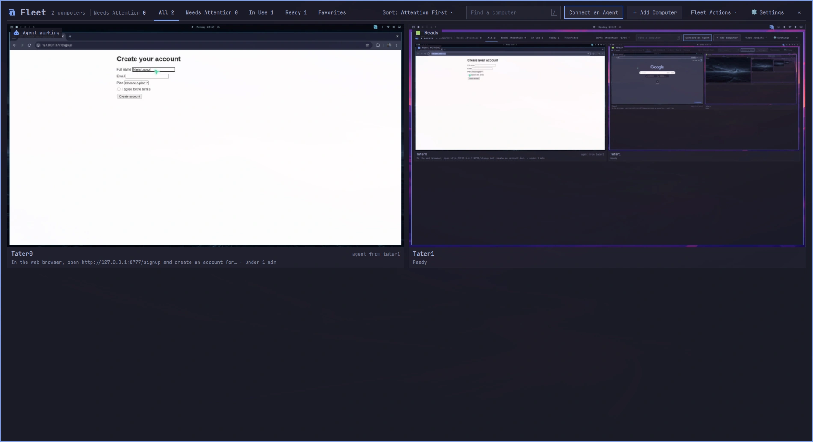
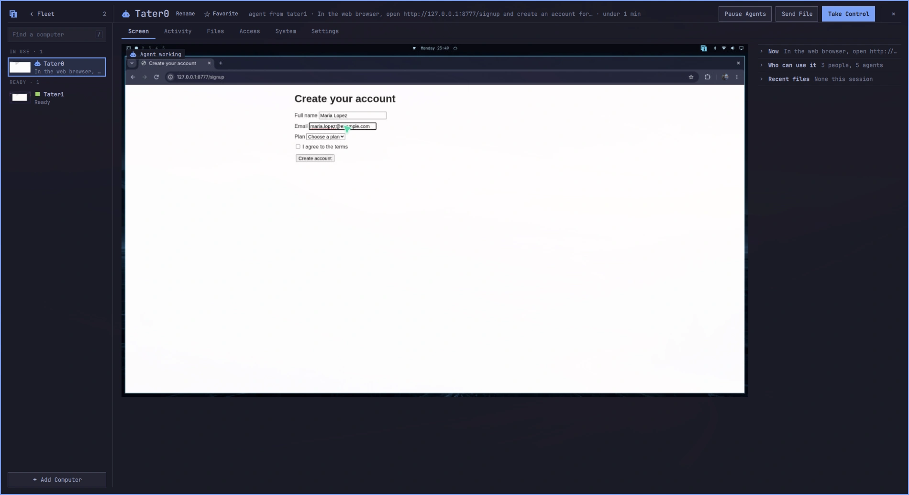
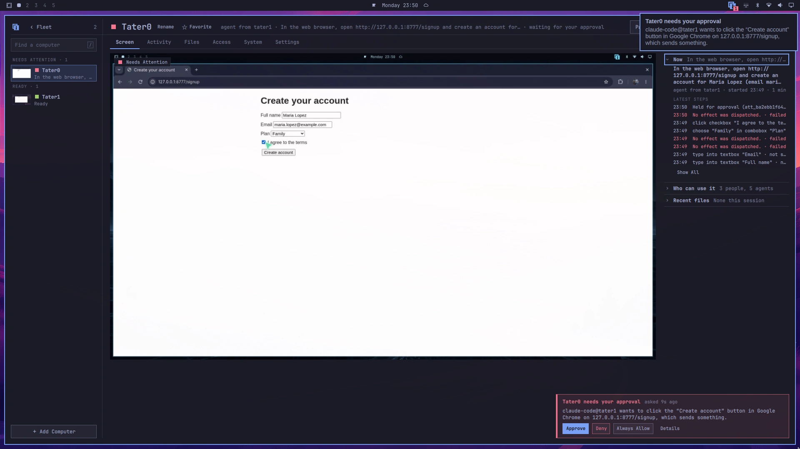

# ibara for Omarchy

[](https://github.com/MayberryDT/omarchy-ibara/actions/workflows/test.yml)
[](LICENSE)

This is the console for [ibara](https://ibara.app), which gives your agents computer use across the Omarchy machines you own. You can use every one of those computers from any other one too. ibara's core is in [MayberryDT/ibara](https://github.com/MayberryDT/ibara).

The console lives in Omarchy's bar: one glance tells you whether anything needs you, and one click opens a wall with a live picture of every computer.



## What it looks like

The plugin has 3 parts.

- The bar shows the ibara mark and one small square in the color of the fleet's most urgent state: red when a computer needs you, purple while you control one, blue while agents work (cyan, or another theme color, in a theme whose blue is hard to tell from its purple). When approvals, login requests, agents' questions or computers need you, it shows how many instead. Whenever it is red, the console says why.
- The quick panel opens when you click the mark while nothing needs you. It counts your computers by state, lists up to 5 of them, the ones that need attention or are in use first, and has Open Console. When something needs you, the click opens it in the console instead.
- The console opens when you right-click the mark. It starts on the fleet wall, with every computer as a live card, attention first.

<!-- Screenshot: the bar mark with a count, and the quick panel open under it. -->

Choose a computer to see it up close. Its page has 8 tabs:

- Screen: the live screen, what is running and this session's files
- Windows: its workspaces and windows, to close or move what an agent left behind
- Logins: the sites it may sign in to with your logins, each Allowed, Ask First or Denied, with Share With… and Remove
- Activity: agent tasks step by step, with before-and-after pictures and their checks
- Files: send files, follow transfers and collect what agents made
- Access: who may watch, send files, take control, run agent tasks and administer, each Allowed, Ask First or Denied
- System: health, logs, a terminal, lock, update and power
- Settings: that computer's own settings



From the console you can also:

- add computers from your tailnet with Add Computer, your own in one step
- share a computer with a friend for an hour, a day, a week or until you revoke it
- take control of a computer in a viewer, and hand it back
- copy the one prompt that connects any agent, under Connect an Agent
- approve or deny what agents ask to do, from the console or from the notification
- answer an agent's question from its notification buttons; free-text questions offer Open Console
- let agents use your logins, one site at a time and only when you allow it, from your own browser
- see what happened while you were away, one line per computer

<!-- Screenshot: Take Control, the viewer window with its "Keys → …" tag. -->

<!-- Screenshot: Share This Computer with a new invite code. -->

Every shape is square, every color comes from your Omarchy theme, and switching themes recolors everything at once.

Approval, login and question requests appear in ibara's own top-right pop-ups while the console isn't focused. The cards use the console's buttons and your theme. Up to three show at once; +N More opens the rest in the console. Click a card's text to open that request. ✕ means Later: the request stays in the console with live buttons. Answered or expired requests leave the stack.

Console Settings has Request Pop-ups, switches for each kind, Show During Do Not Disturb (off by default), and Also Send Desktop Notifications (off by default). Settings survive shell restarts through Omarchy's plugin settings. When pop-ups are off, desktop notifications offer Open and the same answers where the notification server renders buttons. Desktop notifications close through the standard notification protocol; stock Omarchy may keep its own closed card visible until its 15-second timeout.

## Install

The plugin comes with ibara. On an Omarchy computer, run this as yourself, not as root:

```bash
curl -fsSL https://github.com/MayberryDT/ibara/releases/latest/download/install | sh
```

The installer checks the release's signature, installs the signed `ibara` package with this plugin inside it, and runs `ibara setup`. Setup asks for your password once, adds the plugin to Omarchy's bar and restarts the shell once.

If you installed the plugin from Omarchy's plugin marketplace first, its console shows one button, Install ibara, which runs the same installer in a terminal you can read. Setup then replaces the marketplace copy with the one in the package, so the plugin always matches the installed ibara.

## Requirements

- Omarchy 4 with its Quattro shell
- ibara itself (the `ibara` package), which brings the service this plugin talks to, and Tailscale
- a terminal Omarchy can open (`omarchy-launch-floating-terminal-with-presentation`, `omarchy-launch-terminal` or `xdg-terminal-exec`) for the installer and remote shells
- for Live Video (Preview), which is off by default: hardware H.264 encoding on each computer you watch (the `ibara` package brings `wf-recorder`, `qt6-multimedia` and `qt6-multimedia-ffmpeg`)

The plugin has no install hook and copies no credentials. It talks only to the local ibara service, over one private socket in your runtime folder.

## Keyboard

- `/` searches, and arrow keys move across the wall or the list
- Enter opens a computer, and Escape goes back, then closes the console from the fleet
- Left and Right switch tabs
- F5 refreshes
- Ctrl+, opens Settings

## Update and remove

ibara updates itself and this plugin together:

```bash
ibara update
```

After an update the console shows What's New once. `ibara rollback` goes back to the release before.

To remove ibara and this plugin:

```bash
ibara uninstall
```

This keeps this computer's keys, pairings and history for a later install. `ibara uninstall --delete-data` removes them too. Files you received stay in `~/Downloads/Ibara`. Ask each agent you connected to remove its server named `ibara`.

## Privacy and security

Pictures, files and commands go directly between your computers over Tailscale. Nothing goes through a server of ours. Opening the console never takes control of a computer, and closing it never hands control back to agents. In the console, Take Control starts at once and only asks first when another person holds that computer. Question and login cards offer Take Control too. A question with one affirmative answer offers Done & Hand Back while you have control; questions with several options wait for your choice. While you hold control, a floating Hand Back pill stays above the viewer on its screen, even in fullscreen. Click it or press Ctrl+Alt+Shift+H inside the viewer to hand back and close the viewer. Super+Alt+Escape still switches where keys go. Closing the viewer by itself keeps control. A question with no options or one affirmative answer offers Done & Hand Back on the pill; other questions offer Hand Back and Open. Restart, Shut Down, Sleep, Lock Screen, Update, ending a task, and removing or revoking access ask you first and name the computer; access and setting changes apply at once and offer Undo. By default, an agent's send, spend or delete waits for your approval; you can turn that off for agents from your own computers, and agents from anyone else's computer keep asking.

ibara's [security and access guide](https://github.com/MayberryDT/ibara/blob/main/docs/security-and-access.md) explains pairing, permissions and approvals. To report a vulnerability, follow ibara's [security policy](https://github.com/MayberryDT/ibara/blob/main/SECURITY.md).

## Working on the plugin

- [Console reference](docs/reference.md): every surface, command and setting in detail
- [Design](docs/design.md): the visual and interaction rules every change follows
- [The fictional wall](docs/fictional-wall.md): trying changes against made-up computers, without touching your own
- [Contributing](CONTRIBUTING.md): how to propose a change

Run the checks before every commit:

```bash
tests/run
```

It checks the manifest, the QML syntax when `qmllint` (from `qt6-declarative`) is installed, the model tests and, when Omarchy is installed, `omarchy plugin validate`. It needs Python 3 and Node, which are used only for tests, never at run time.

To run the plugin from a checkout instead of the installed copy, point Omarchy's plugin folder at it and restart the shell:

```bash
ln -sfn "$(pwd)" ~/.config/omarchy/plugins/io.zet.ibara
omarchy restart shell
omarchy-shell shell summon io.zet.ibara '{}'
```

`ibara setup` links the installed copy back.

## License

MIT. See [LICENSE](LICENSE). ibara's core is GPL-3.0-only.
